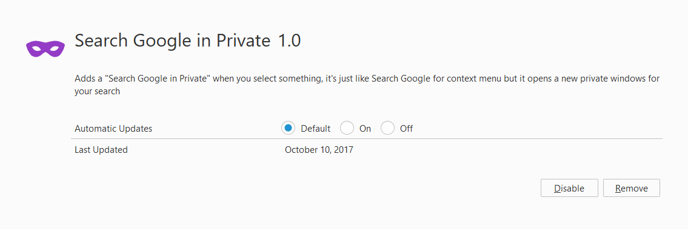
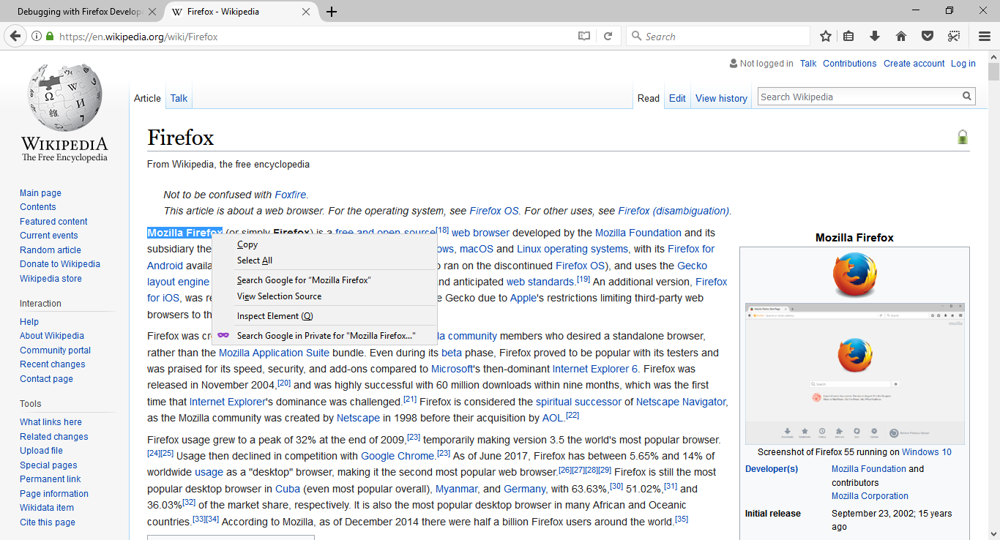

# Search Google in Private
Adds a `Search Google in Private for <selected text>` when you select something, it's just like Search Google for <selected-text>` context menu but it opens a new private windows for your search

## [Get it on AMO](https://addons.mozilla.org/en-US/firefox/addon/search-google-in-private/)

### How-to
1. `git clone https://github.com/electron0zero/search-google-in-private.git`
2. install [web-ext](https://developer.mozilla.org/en-US/Add-ons/WebExtensions/Getting_started_with_web-ext) by running `npm install --global web-ext`
3. `cd` into extension folder
4. run `web-ext run` and it will add this extension to your firefox
5. go to `about:debugging` in opened browser and you can access [extension debugger](https://developer.mozilla.org/en-US/Add-ons/WebExtensions/Debugging)

### Screenshots

### License
Mozilla Public License Version 2.0